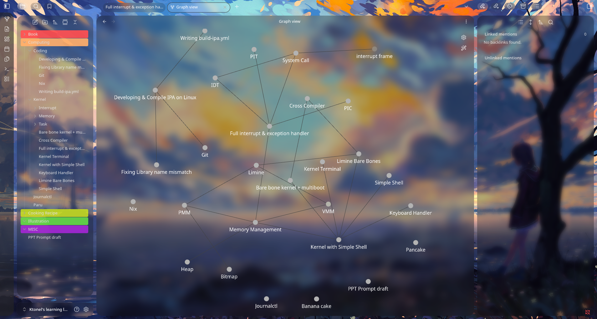

# TransparentBlur 
#### A transparent blur theme for obsidian, inspirated by [Translucen](https://github.com/CapnKitten/Translucence)

## Previews
#### Main area 

#### Settings

#### Graph View

## Milestone
- add border theme glass blur (unified)
- light theme
